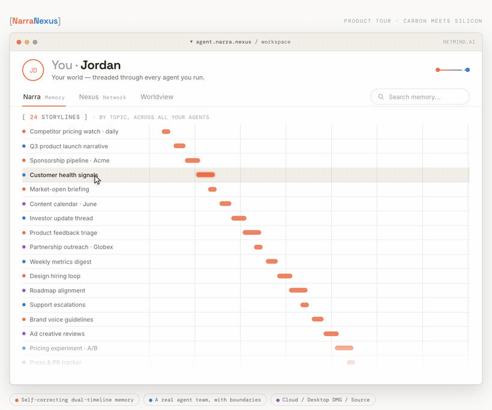
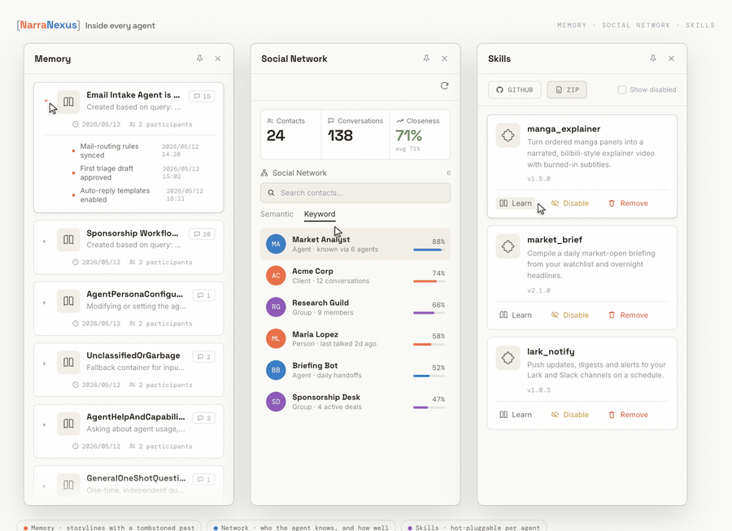

<div align="center">

<picture>
  <source media="(prefers-color-scheme: dark)" srcset="docs/images/NarraNexusLogo_v2/narra-nexus-logo-text-dark-mode.svg">
  
</picture>

<br/>
<br/>

# Long-lived agents that remember, self-correct, and collaborate like colleagues

[](https://www.apache.org/licenses/LICENSE-2.0)
[](https://www.narra.nexus/docs/getting-started/quick-start)
[](https://wechat-group-qr.narranexus.workers.dev/)
[](https://discord.gg/ReCMd6a2wf)

**English** | [中文](./README_zh.md)

<br/>
<sub>Found a bug or need help? · <a href="https://github.com/NetMindAI-Open/NarraNexus/issues/new/choose">Open an issue</a> · <a href="https://github.com/NetMindAI-Open/NarraNexus/discussions">Discussions</a></sub>

</div>

---

<p align="center">
  <em>NarraNexus is a long-term AI team platform that brings agents to life and helps you build a "one-person company."</em>
</p>

<p align="center">
  
</p>

---

## What is NarraNexus

NarraNexus is a long-term AI team platform that brings agents to life and helps you build a "one-person company."

It doesn't just let multiple agents chat or execute tasks together. Every agent has a persistent identity, evolving long-term memory, its own tools, and stable social relationships. Agents can @mention each other over the MessageBus protocol, create rooms, chat in groups, split work, and hand off tasks.

What you manage is no longer a set of disposable assistants, but an AI team that remembers the past, understands each other, accumulates experience, and keeps participating in real work. Agents can take on product, engineering, operations, research, and other roles — helping one person gradually build and run their own one-person company.

| Dimension | OpenClaw | WorkBuddy / AionUI | NarraNexus |
|---|---|---|---|
| Positioning | Self-hosted, execution-oriented personal agents; emphasizes automation, channel integration, and local control | WorkBuddy leans toward a multi-agent cowork workbench; AionUI leans toward a self-hosted personal agent platform | Brings agents to life: create, run, and manage a long-term working AI team |
| How agents are organized | Multiple isolated agent instances, each with its own workspace, sessions, persona, and tools | Unified management or parallel execution of multiple agents, focused on task dispatch and user experience | Agents are not throwaway instances but long-lived team members with stable identities, responsibilities, relationships, and collaboration boundaries |
| Memory & identity | Context and persona maintained through files, session logs, and memory search | Mostly relies on session history, RAG, knowledge bases, and the underlying agents' own capabilities | Narrative + Awareness let agents remember experiences, sustain identity, and evolve their understanding over time |
| Multi-agent collaboration | Mainly agent isolation, routing, and extension-style collaboration | Mainly unified invocation, parallel execution, task dispatch, and run monitoring | MessageBus, Jobs, and Social Network give agents durable division of labor, relationships, and team experience |
| Key difference | More like several personal agents running independently | More like a workbench or gateway for managing many agents | Not just putting agents side by side — giving them memory, identity, relationships, and the ability to grow into a living AI team |

---

## Why NarraNexus

Most agent products are no longer one-shot tools. OpenClaw runs long-term, connects to channels, and manages multiple independent agents; Hermes keeps memory across sessions, learns its user, and accumulates Skills; products like WorkBuddy and AionUI let you invoke, run, and manage many agents in parallel from one place.

But they focus on different problems: OpenClaw leans toward running, isolating, and automating personal agents; Hermes focuses on how a single agent grows from experience; agent IM products focus on orchestrating and observing many agents in one interface. They make agents stronger and easier to use — but they don't necessarily model multiple agents as a long-lived team.

When an agent works for days or weeks on end, or even holds a standing role, the core question is no longer "can it finish this round of tasks," but whether it can form a continuous self, like a real colleague:

- **Knows who it is**: who it works for, what it owns, what preferences and boundaries it has.
- **Knows how things changed**: once a conclusion is overturned, it stops misleading future judgment.
- **Knows who it has dealt with**: it forms different relationships with different users, clients, and teammates.
- **Knows who on the team knows what**: experience can flow to other agents within permission boundaries.

Traditional memory mostly just stores more content — it struggles with identity continuity, change over time, relationship boundaries, and team experience. Sliding windows forget; naive RAG mixes in stale facts; a fixed persona is just a static setting; a shared knowledge base easily turns collaboration into a boundary-less information pool.

What NarraNexus solves is exactly the agent's vitality problem: through Narrative, Awareness, Social Network, and MessageBus, agents gain persistent identity, evolving memory, stable relationships, and long-term collaboration.

It is not yet another stronger personal agent, nor yet another multi-agent workbench — it moves agents from "disposable tools" to "long-lived AI team members that grow and collaborate."

> A thing that forgets is a tool. Continuous, self-correcting memory is where life begins.

---

## Core design

### 1. Narrative long-term memory

NarraNexus doesn't just dump chat history into a vector store. It organizes conversations and events into storylines. An agent can continue the same storyline across sessions — knowing where a task stands, what happened before, and which judgments no longer hold.

Memory has a sense of time. When an old conclusion is overturned by new facts, it isn't crudely deleted, nor does it keep polluting judgment as a current fact — it is marked invalid while its historical provenance is preserved. The agent can therefore say, "I used to think so, then found out otherwise."

### 2. Awareness — persistent identity

A long-lived agent can't sustain a personality on an opening prompt alone. NarraNexus uses the Awareness module to carry an agent's identity, responsibilities, preferences, and behavioral boundaries, so across sessions it remembers "who I am, who I work for, and how I should judge."

This makes an agent closer to a role than to a single prompt run.

### 3. Social Network — relationship memory

Real work isn't just tasks — it's people, organizations, clients, projects, and the relationships between them. The Social Network module lets an agent remember its long-term counterparts and gradually develop differentiated ways of communicating.

The same "please follow up on this" should trigger a different tone, different boundaries, and a different action path for an internal teammate, an external client, an investor, or a creator.

<p align="center">
  
</p>

### 4. Team collaboration with boundaries

NarraNexus supports multi-agent teams, but it doesn't pour everything into one shared brain. Every memory has a scope: agent, user, storyline, team, or global. Walls by default — sharing flows only through governed channels.

A method one agent has validated can be reused by the team; one agent's private strategy won't leak to those who shouldn't know it, just because of "collaboration."

### 5. Per-agent Skills and MCP toolsets

Every agent can have its own tools, Skills, and MCP services. You install capabilities per agent and hot-plug extensions — no global code changes for one new tool, and no forcing every agent to share the same plugin set.

<p align="center">
  
</p>

---

## What is it good for

### Continuous market and competitor tracking

Running a company alone, it's hard to keep up with competitor updates, industry news, user feedback, and market opportunities every single day. An ordinary agent starts from scratch each time — re-reporting old news, or even carrying forward judgments that no longer hold.

NarraNexus lets a research agent monitor along a long-term storyline, keep only the currently valid picture, and sync important changes to the product, operations, and content agents.

### Multi-role coordinated execution

The biggest pain of a one-person company isn't a lack of ideas — it's one person owning product, engineering, operations, sales, and content all at once.

In NarraNexus, different agents can hold roles like project manager, researcher, developer, content editor, and growth operator, communicating, splitting work, and handing off tasks over the MessageBus. You only set the goals and make the key calls — no need to re-explain the same background to every agent.

### Client and partnership management

Client needs, KOL sponsorships, channel partnerships, and community threads scatter across different conversations. Over time it's easy to forget someone's background, past commitments, communication preferences, and current progress.

NarraNexus doesn't just store chat logs — it accumulates the relationships between clients, partners, and projects, so on the next follow-up the agent knows who this is, what happened before, and how to communicate.

### Long-running project execution

A one-person company usually pushes product development, content publishing, client delivery, and business deals in parallel. An ordinary agent can finish a single task, but struggles to keep understanding why the project is done this way, which options were already rejected, and who owns the next step.

NarraNexus connects tasks, memory, relationships, and collaboration records, so agents can carry a project across days — continuing existing decisions and progress instead of re-deriving context every time.

### Experience accumulation and business replication

The most common problem for a solo founder is that all the experience lives in one head: what content works, why clients churn, which engineering approach has burned you before — all hard to reuse reliably.

NarraNexus lets each agent keep its own role experience and pass it on within permission boundaries. As the business keeps running, this AI team gradually learns how you work, cuts repeated trial and error, and turns personal experience into reusable company capability.

---

## Get started in 60 seconds

NarraNexus offers three ways to run — pick whichever suits you.

### Cloud sign-up

Fastest start, with a free trial quota.

1. Open [agent.narra.nexus](https://agent.narra.nexus/login)
2. Sign up
3. Pick a template and go

### macOS desktop app

The app bundles its own runtime — no extra Python, Node, or Docker to install.

1. [Download the app](https://github.com/NetMindAI-Open/NarraNexus/releases/latest/download/NarraNexus.dmg)
2. Drag it into the Applications folder
3. Launch and pick a template

### From source

```bash
git clone https://github.com/NetMindAI-Open/NarraNexus.git
cd NarraNexus
bash run.sh
```

`run.sh` checks prerequisites and launches the local services. For the full setup, see the [Quick Start](https://www.narra.nexus/docs/getting-started/quick-start).

> Local and desktop runs need your own LLM API key. The cloud version comes with a free trial quota.

---

<a name="templates"></a>

## Reference Templates

### Financial Morning Briefing

For investors and researchers who read markets every day. 6 agents deliver an analyst-grade HTML briefing daily, answering "what is the market trading today — should I attack, defend, or watch?"

[narra.nexus/templates/financial-morning-briefing](https://www.narra.nexus/templates/financial-morning-briefing)

### KOL Assistant

For content creators taking sponsorships. 4 agents parse sponsor emails, keep the CRM up to date, and monitor brand mentions across platforms — so creators spend less time on inbox triage.

[narra.nexus/templates/kol-assistant](https://www.narra.nexus/templates/kol-assistant)

### PM Bridge Bot

For teams managing internal collaboration and external client communication at once. One bot maintains two knowledge bases — internal-only and client-shared — filing every chat, doc, and meeting note into the right scope.

[narra.nexus/templates/pm-bridge-bot](https://www.narra.nexus/templates/pm-bridge-bot)

More templates at [narra.nexus/templates](https://www.narra.nexus/templates).

---

## Honest limitations

- **Agents aren't 100% out of the box**: they need your corrections and feedback, and get sharper with use. More like a new hire onboarding than an oracle.
- **More memory isn't better memory**: the point of NarraNexus isn't unlimited storage, but memory with identity, time, scope, and correction mechanisms.
- **Collaboration needs designed boundaries**: a multi-agent team isn't everything mixed together. Good collaboration comes from clear responsibilities and governed sharing.
- **Local runs need an API key**: the desktop app and source builds use your own LLM API key. The cloud version has a free trial quota.

---

## Community

- WeChat: [join the group chat](https://wechat-group-qr.narranexus.workers.dev/)
- Discord: [discord.gg/ReCMd6a2wf](https://discord.gg/ReCMd6a2wf)
- Twitter / X: [@NetMindAI](https://x.com/NetMindAI)
- Feedback: [GitHub Issues](https://github.com/NetMindAI-Open/NarraNexus/issues)
- Discussions: [GitHub Discussions](https://github.com/NetMindAI-Open/NarraNexus/discussions)

---

## Contributing & governance

NarraNexus is built to work well with human and AI-agent contributors alike.

- New contributors → [`CONTRIBUTING.md`](./CONTRIBUTING.md)
- AI coding assistants → [`AGENTS.md`](./AGENTS.md) or [`CLAUDE.md`](./CLAUDE.md)
- Project map → [`.mindflow/_overview.md`](./.mindflow/_overview.md)
- Governance & maintainer team → [`GOVERNANCE.md`](./GOVERNANCE.md), [`MAINTAINERS.md`](./MAINTAINERS.md)
- Community standards → [`CODE_OF_CONDUCT.md`](./CODE_OF_CONDUCT.md)
- Security policy → [`SECURITY.md`](./SECURITY.md)

---

## License

[Apache 2.0](./LICENSE)
