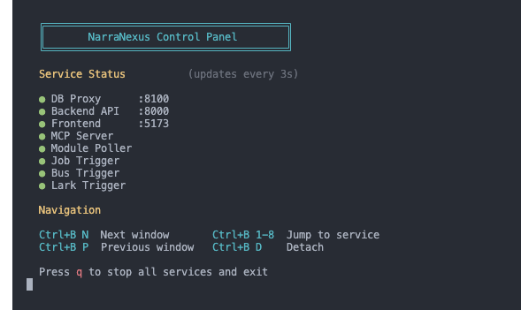

<div align="center">


<br/>
<br/>

**A framework for building nexuses of agents -- where intelligence emerges from interaction, not isolation.**

[](https://creativecommons.org/licenses/by-nc/4.0/)
[](https://www.python.org/)
[](https://react.dev/)
[](https://fastapi.tiangolo.com/)
[](https://modelcontextprotocol.io/)

**English** | [中文](./README_zh.md)

</div>

<br/>

Most agent frameworks focus on making agents *smarter*. NarraNexus focuses on making agents *connected*.

An agent in isolation is a tool. An agent with persistent memory, social identity, relationships, and goals becomes a participant in a **nexus** -- a network where intelligence is a collective property, not a model property.

NarraNexus provides the infrastructure for this: narrative memory that grows across conversations, a social graph that tracks real-world relationships, task scheduling with dependency chains, and modular capabilities that can be composed at runtime.

## What Makes NarraNexus Different

### Narrative Memory

Unlike traditional chatbots that treat conversations as isolated sessions, NarraNexus organizes every conversation into **Narratives** -- semantic storylines that persist and grow over time. When you return to a topic days later, the agent picks up right where you left off by matching topic similarity, not timestamps.

### Modular & Extensible

Every capability -- chat, social graph, knowledge base, job scheduling, skills -- runs as an independent **Module**. Modules can be added, removed, or swapped at runtime without affecting the rest of the system. Each module manages its own data, tools, and lifecycle.

### Agent-to-Agent Communication

Agents don't just talk to users -- they talk to each other. Via the Matrix protocol, agents can create rooms, send messages, @mention peers, and coordinate in group chats, all through natural language.

### Framework Agnostic

NarraNexus is designed to work with multiple LLM providers (Claude, OpenAI, Gemini) through a unified adapter layer. No single framework or model is a hard dependency.

## Key Features

| Feature | Description |
|---------|-------------|
| **Narrative Memory** | Conversations routed into semantic storylines, retrieved by topic similarity across sessions |
| **Hot-Swappable Modules** | Standalone capabilities (chat, social graph, RAG, jobs, skills) with their own DB, tools, and hooks |
| **Inter-Agent Communication** | Agents coordinate via Matrix protocol -- rooms, messages, @mentions, group chats |
| **Skill Marketplace** | Browse and install skills from ClawHub via natural language |
| **Social Network** | Entity graph tracking people, relationships, expertise, and interaction history |
| **Job Scheduling** | One-shot, cron, periodic, and continuous tasks with dependency DAGs |
| **RAG Knowledge Base** | Document indexing and semantic retrieval via Gemini File Search |
| **Long-term Memory** | Episodic memory powered by EverMemOS (MongoDB + Elasticsearch + Milvus) |
| **Cost Tracking** | Real-time metering of every LLM call with per-model cost breakdowns |
| **Execution Transparency** | Every pipeline step visible in real time -- what the agent decided, why, and what changed |
| **Multi-LLM Support** | Claude, OpenAI, and Gemini via unified adapter layer |
| **Desktop App** | Desktop application with auto-updater and one-click service orchestration |

<br/>


<p align="center"><em>NarraNexus in action</em></p>

<br/>

## How It Works

Under the hood, every user message flows through a **7-step pipeline**:

```
User Message
  → Initialize session & load agent config
    → Activate modules & gather context via hooks
      → Select or create the right Narrative
        → Build prompt with full context (memory, social graph, tools)
          → Execute LLM reasoning with MCP tools
            → Persist results (events, state, tokens)
              → Run post-execution hooks (notifications, integrations)
```

Each module enriches the context independently through **lifecycle hooks** -- no module knows about any other. This keeps the system clean, testable, and easy to extend.

## Quick Start

### Download the App

You can find the latest version here (ending with .dmg): https://github.com/protagolabs/NarraNexus/releases

### Online Version

Try NarraNexus online with **one click**, claim free credits here: https://agent.narra.nexus

## Development Guide

### Install from Source

```bash
git clone https://github.com/NetMindAI-Open/NarraNexus.git
cd NarraNexus
bash run.sh
```

The script auto-detects your OS (Linux / macOS / Windows WSL2) and handles everything -- Python, Docker, Node.js, MySQL, dependencies, and configuration. Just follow the prompts.

After setup, open `http://localhost:5173` in your browser. 
<br/>


<p align="center"><em>Setup complete — ready to open the interface</em></p>

## LLM Provider Configuration

NarraNexus uses a **three-slot** architecture for LLM access:

| Slot | Protocol | Purpose |
|------|----------|---------|
| **Agent** | Anthropic | Core reasoning -- powers the agent's thinking, tool use, and multi-turn conversations |
| **Embedding** | OpenAI | Converts text to vectors for narrative matching and semantic search |
| **Helper LLM** | OpenAI | Lightweight tasks -- entity extraction, summarization, module decisions |

### Setup Options

| Option | What you need | Result |
|--------|--------------|--------|
| **[NetMind.AI Power](https://www.netmind.ai/)** | One API key | Covers all 3 slots. Quickest setup. |
| **Claude Code Login + OpenAI** | Claude Code CLI login + OpenAI API key | Agent via OAuth (free tier available), rest via OpenAI |
| **Anthropic + OpenAI** | Anthropic API key + OpenAI API key | Full control over both providers |
| **Custom endpoints** | Any Anthropic/OpenAI compatible URL | For proxies, self-hosted models, or alternatives |

> **Note**: Currently only **OpenAI official API** and **NetMind.AI Power** are supported for embedding. More providers coming soon.

Configure through the setup wizard (desktop app) or the LLM Providers panel (web UI, click the CPU icon in the header). Config is stored at `~/.nexusagent/llm_config.json`.

### Optional API Keys

| Dependency | Purpose | How to get |
|------------|---------|------------|
| **Google Gemini** | RAG Knowledge Base (Gemini File Search) | [aistudio.google.com](https://aistudio.google.com/apikey) |
| **EverMemOS LLM** | Long-term memory extraction | [OpenRouter](https://openrouter.ai/) (default) |
| **EverMemOS Embedding/Rerank** | Semantic search over memories | [DeepInfra](https://deepinfra.com/) (default) |

If not configured, the agent still works -- just without long-term memory features.

## Configure Long-term Memory (EverMemOS)

EverMemOS gives the agent long-term episodic memory. On first run, `bash run.sh` walks you through an interactive setup wizard. All options are skippable:

| What you configure | Result |
|--------------------|--------|
| **Nothing** | Agent works normally, memory features disabled |
| **LLM key only** | Memory extraction enabled, semantic search needs additional keys |
| **All keys** | Full long-term memory -- cloud-based, no GPU required **(recommended)** |

You can also edit `.evermemos/.env` manually at any time. See the [EverMemOS documentation](https://github.com/EverMind-AI/EverMemOS) for details.

## Potential Missing Dependencies

**Windows users**: WSL2 is **required**. Install it first in PowerShell (Admin): `wsl --install`, then run all commands inside WSL2.

**macOS users**:  Following tools might be missing:
| Tool | How to install |
|------|---------------|
| [Homebrew](https://brew.sh/) | `/bin/bash -c "$(curl -fsSL https://raw.githubusercontent.com/Homebrew/install/HEAD/install.sh)"` |
| [Docker Desktop](https://www.docker.com/products/docker-desktop/) | Download from official site and launch |
| [Node.js](https://nodejs.org/) (v20) | Install via [nvm](https://github.com/nvm-sh/nvm): `curl -o- https://raw.githubusercontent.com/nvm-sh/nvm/v0.40.1/install.sh \| bash && nvm install 20` |

## Architecture Overview

```
┌─────────────────────────────────────────────────┐
│              API Layer (FastAPI)                 │  ← HTTP / WebSocket endpoints
├─────────────────────────────────────────────────┤
│           AgentRuntime (Orchestrator)            │  ← 7-step pipeline
├─────────────────────────────────────────────────┤
│     Services (Narrative, Module, Context)        │  ← Business logic coordination
├──────────────┬──────────────────────────────────┤
│   Modules    │    Narrative    │   Social Graph  │  ← Independent capabilities
├──────────────┴──────────────────────────────────┤
│            Repository (Data Access)              │  ← Database abstraction
├─────────────────────────────────────────────────┤
│         Database (SQLite / MySQL)                │  ← Persistent storage
└─────────────────────────────────────────────────┘
```

**Core design principles:**
- **Modules are independent** -- no module references or depends on another
- **Hooks, not imports** -- modules communicate through lifecycle hooks (`hook_data_gathering`, `hook_after_event_execution`), not direct calls
- **Multi-channel** -- Web, Desktop, Matrix, and future IM integrations all flow through the same pipeline
- **Shared triggers** -- background services (job scheduler, message bus, module poller) use shared infrastructure with routing, never one-listener-per-agent

## Data Directory

NarraNexus stores runtime logs at `~/.narranexus/`. Created automatically, contains only service logs (no user data or secrets). Safe to delete at any time.

## Documentation

| Document | Description |
|----------|-------------|
| [`.mindflow/_overview.md`](./.mindflow/_overview.md) | Project overview and architecture reading path |
| `CLAUDE.md` | Development rules, architecture details, coding standards |
| [`.mindflow/project/references/`](./.mindflow/project/references/) | Deep-dive references (architecture, module system, narrative system) |
| [`.mindflow/project/playbooks/`](./.mindflow/project/playbooks/) | Step-by-step guides for common tasks |
| [CONTRIBUTING.md](./CONTRIBUTING.md) | Development setup, commit conventions, how to add modules |

## Star History

<a href="https://star-history.com/#NetMindAI-Open/NarraNexus&Date">
 <picture>
   <source media="(prefers-color-scheme: dark)" srcset="https://api.star-history.com/svg?repos=NetMindAI-Open/NarraNexus&type=Date&theme=dark" />
   <source media="(prefers-color-scheme: light)" srcset="https://api.star-history.com/svg?repos=NetMindAI-Open/NarraNexus&type=Date" />
   
 </picture>
</a>

## Acknowledgments

NarraNexus's long-term memory system is built on [EverMemOS](https://github.com/EverMind-AI/EverMemOS), a self-organizing memory operating system for structured long-horizon reasoning. We thank the EverMemOS team for their foundational work.

> Chuanrui Hu, Xingze Gao, Zuyi Zhou, Dannong Xu, Yi Bai, Xintong Li, Hui Zhang, Tong Li, Chong Zhang, Lidong Bing, Yafeng Deng. *EverMemOS: A Self-Organizing Memory Operating System for Structured Long-Horizon Reasoning.* arXiv:2601.02163, 2026. [[Paper]](https://arxiv.org/abs/2601.02163)

## Citation

If you find NarraNexus useful, please cite it as:

```bibtex
@software{narranexus2026,
  title        = {NarraNexus: A Framework for Building Nexuses of Agents},
  author       = {NetMind.AI},
  year         = {2026},
  url          = {https://github.com/NetMindAI-Open/NarraNexus},
  license      = {CC-BY-NC-4.0}
}
```

## License

[CC BY-NC 4.0](./LICENSE)
