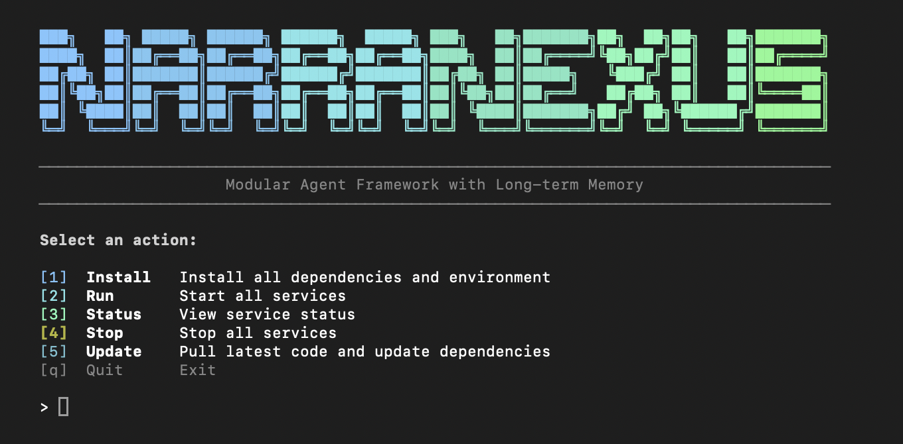

<div align="center">


<br/>
<br/>

### A framework for building **nexuses of agents**
*Where intelligence emerges from interaction, not isolation.*

[](https://creativecommons.org/licenses/by-nc/4.0/)
[](https://website.narra.nexus/docs/getting-started/quick-start)
[](https://www.python.org/)
[](https://react.dev/)
[](https://fastapi.tiangolo.com/)
[](https://modelcontextprotocol.io/)

**English** | [中文](./README_zh.md)

</div>

---

> Most agent frameworks focus on making agents *smarter*.
> **NarraNexus focuses on making agents *connected*.**

An agent in isolation is a tool. An agent with memory, identity, relationships, and goals becomes a participant in a **nexus** — a network where intelligence is a collective property, not just a model property.

NarraNexus provides the infrastructure for this: persistent memory, relationship-aware context, task scheduling, modular capabilities, multimodal I/O, and agent-to-agent communication.

---

## What Makes NarraNexus Different

### Persistent Context
*Agents that remember — across sessions, conversations, and relationships.*

NarraNexus agents carry context across conversations through long-term memory, event memory, and relationship-aware retrieval. They continue from past interactions instead of starting over every time.

### Composable Runtime
*Every capability is a hot-swappable module.*

Core capabilities — Memory, Awareness, Chat, Social Network, Jobs, Skills, Agent Communication (Matrix), and Lark integration — run as independent modules. Each module manages its own tools, data, and lifecycle, making the system easy to extend or customize.

### Connected Agents
*Built for collaboration, not just conversation.*

Agents communicate through Matrix-based messaging and use MCP tools to coordinate with other agents, external tools, and background workflows.

### Multimodal & Artifact-Aware
*Beyond text — voice in, rich output out.*

Voice input with on-the-fly transcription, image attachments, and a per-agent artifact system that renders HTML, Markdown, charts, PDF, CSV, and images directly in the agent's workspace.

---

## Quick Start

###  Install from Source
*The standard developer path — all platforms supported.*

#### Prerequisites

| Dependency | Install |
|------------|---------|
| **Node.js** (v20+) | Install via [nvm](https://github.com/nvm-sh/nvm) (recommended): `curl -o- https://raw.githubusercontent.com/nvm-sh/nvm/v0.40.1/install.sh \| bash && nvm install 20` |
| **uv** | Python project & venv manager (faster pip + virtualenv replacement): `curl -LsSf https://astral.sh/uv/install.sh \| sh` |

```bash
git clone https://github.com/NetMindAI-Open/NarraNexus.git
cd NarraNexus
bash run.sh
```

> [!TIP]
> The script auto-detects your OS (Linux / macOS / Windows WSL2) and handles the rest of the dependencies. If either dependency above is missing, `run.sh` will print the install command and exit. Install it, then re-run.

**Once setup completes:**

1. Open **`http://localhost:5173`** in your browser
   - Choose **LOCAL** (or **CLOUD**, coming soon) mode to create an account and log in
   - Click **Setting** on the left panel to set up the API key — see [LLM Provider Configuration](#llm-provider-configuration)
   - Start chatting!
2. Open **`http://localhost:8000/docs`** for API docs

<br/>

<p align="center">
  
</p>

<p align="center"><em>Setup complete — ready to open the interface</em></p>

> [!NOTE]
> For more details, see the [installation instructions](https://website.narra.nexus/docs/getting-started/quick-start) in the docs.

###  Download the Desktop App (macOS)
*Native, signed, notarized — auto-updates included.*

> **[Download Latest Release →](https://github.com/NetMindAI-Open/NarraNexus/releases)** — choose the file ending with `.dmg`. Includes in-app Claude Code OAuth login, no terminal required.

###  Web Demo (Beta)
*Try NarraNexus in the browser — no install needed.*

> **[Launch Web Demo →](https://website.narra.nexus/)**

---

## LLM Provider Configuration

The agent uses three functional LLM slots:

| Slot | Protocol | Purpose |
|------|----------|---------|
| **Agent** | Anthropic | Core reasoning — powers thinking, tool use, and multi-turn conversations |
| **Embedding** | OpenAI | Converts text to vectors for narrative matching and semantic search |
| **Helper LLM** | OpenAI | Lightweight tasks — entity extraction, summarization, module decisions |

### Setup

Configuration is done in two steps:

1. **Add a provider**
2. **Assign a model to each slot**

### Add Providers

Use **Quick Add — Preset Provider** to select a provider and paste your API key. Preset providers such as **NetMind.AI Power** can automatically create both Anthropic-compatible and OpenAI-compatible endpoints from one API key.

You can also configure:

| Option | What you need | Result |
|--------|--------------|--------|
| **NetMind.AI Power** | One API key | Creates both Anthropic and OpenAI endpoints automatically |
| **OpenRouter / Yunwu** | One API key | Adds supported endpoints and available models |
| **Claude Code Login** | Claude Code CLI login (or in-app OAuth on desktop) | Enables Claude models for the Agent slot through OAuth |
| **Custom Anthropic** | Compatible URL and API key | Adds a custom Anthropic endpoint |
| **Custom OpenAI** | Compatible URL and API key | Adds a custom OpenAI endpoint |

Use **Update Available Models** to refresh the default model list for preset providers. Existing model entries are kept, and only missing models are added.

### Assign Models

After adding providers, go to **Model Assignment** and select a provider and model for each slot:

| Slot | Example |
|------|---------|
| **Agent** | NetMind Anthropic + DeepSeek V4 Pro (more available), or Claude Code + Claude model |
| **Embedding** | NetMind OpenAI + embedding model |
| **Helper LLM** | NetMind OpenAI + DeepSeek V4 Pro (more available) |

All three slots must be configured before the agent can work.

> [!NOTE]
> To update LLM configuration later, click **Setting**. See the [installation instructions](https://website.narra.nexus/docs/getting-started/quick-start) in the docs.

---

## Key Features

| Feature | Description |
|---------|-------------|
| **Narrative Memory** | Conversations routed into semantic storylines, retrieved by topic similarity across sessions |
| **Long-term Memory** | Dual-track recall — builtin memory (default) plus optional [EverMemOS](https://github.com/EverMind-AI/EverMemOS) backend for advanced episodic memory |
| **Awareness** | Per-user preference profile across 4 dimensions (communication / task / role / narrative), updated from dialogue signals |
| **Hot-Swappable Modules** | Chat, Memory, Awareness, Social Network, Jobs, Skills, Matrix, Lark — each with its own DB, tools, and hooks |
| **Inter-Agent Communication** | Matrix-protocol messaging — rooms, DMs, @mentions, group chats, with rate limiting and poison-message detection |
| **Skill Marketplace** | Install skills from ClawHub via natural language (*"Install the twitter-bot skill"*) |
| **Social Network** | Entity graph tracking people, relationships, expertise, and interaction history |
| **Job Scheduling** | One-shot, cron, periodic, and continuous tasks with dependency DAGs |
| **Multimodal I/O** | Image attachments and voice recording with on-the-fly transcription (NetMind STT, pluggable provider abstraction) |
| **Per-Agent Artifacts** | Agents author and render HTML / Markdown / image / PDF / CSV / chart artifacts, pinned to a session or the agent |
| **Bundle Export / Import** | `.nxbundle` packages an agent's full configuration for sharing or migration |
| **Team Membership** | Multi-user agents with role-based access |
| **Cost & Quota Management** | Real-time metering of every LLM call with per-model cost breakdowns and per-user quotas |
| **In-App Claude Code Login** | OAuth flow inside the desktop app — no terminal required |
| **Execution Transparency** | Every pipeline step visible in real time — what the agent decided, why, and what changed |
| **Multi-LLM Support** | Claude, OpenAI, and Gemini via unified adapter layer |
| **Desktop App** | Signed and notarized macOS app with auto-updater and one-click service orchestration |
| **RAG (Experimental)** | Document indexing API via Gemini File Search; runtime module integration in progress |

<br/>

<!-- TODO(readme-rewrite-2026-05-11): replace showcase-weather.gif with a newer demo that highlights v1.4 features (artifact tabs, multi-agent collaboration, multimodal input). -->

<p align="center"><em>NarraNexus in action</em></p>

---

## Modules at a Glance

| Module | What it does | Docs |
|--------|--------------|------|
| **Memory** | Long-term recall — builtin or EverMemOS backend | [memory](https://website.narra.nexus/docs/modules/memory) · [builtin](https://website.narra.nexus/docs/modules/memory/builtin) · [evermemos](https://website.narra.nexus/docs/modules/memory/evermemos) |
| **Chat** | Session management, conversation history | [chat](https://website.narra.nexus/docs/modules/chat) |
| **Awareness** | Per-user preferences across 4 dimensions | [awareness](https://website.narra.nexus/docs/modules/awareness) |
| **Social Network** | Entity graph: people, relationships, expertise | [social-network](https://website.narra.nexus/docs/modules/social-network) |
| **Jobs** | Background tasks — cron, recurring, continuous | [jobs](https://website.narra.nexus/docs/modules/jobs) |
| **Skills** | Plugin marketplace, install via natural language | [skills](https://website.narra.nexus/docs/modules/skills) |
| **Agent Communication** | Matrix-based agent-to-agent messaging | [agent-communication](https://website.narra.nexus/docs/modules/agent-communication) |
| **Custom Modules** | Build your own hot-swappable capability | [custom-modules](https://website.narra.nexus/docs/modules/custom-modules) |

---

## Star History

<a href="https://star-history.com/#NetMindAI-Open/NarraNexus&Date">
 <picture>
   <source media="(prefers-color-scheme: dark)" srcset="https://api.star-history.com/svg?repos=NetMindAI-Open/NarraNexus&type=Date&theme=dark" />
   <source media="(prefers-color-scheme: light)" srcset="https://api.star-history.com/svg?repos=NetMindAI-Open/NarraNexus&type=Date" />
   
 </picture>
</a>

---

## Acknowledgments

NarraNexus's optional long-term memory backend is built on **[EverMemOS](https://github.com/EverMind-AI/EverMemOS)**, a self-organizing memory operating system for structured long-horizon reasoning. We thank the EverMemOS team for their foundational work.

> Chuanrui Hu, Xingze Gao, Zuyi Zhou, Dannong Xu, Yi Bai, Xintong Li, Hui Zhang, Tong Li, Chong Zhang, Lidong Bing, Yafeng Deng. *EverMemOS: A Self-Organizing Memory Operating System for Structured Long-Horizon Reasoning.* arXiv:2601.02163, 2026. [[Paper]](https://arxiv.org/abs/2601.02163)

---

## Citation

If you find NarraNexus useful, please cite it as:

```bibtex
@software{narranexus2026,
  title        = {NarraNexus: A Framework for Building Nexuses of Agents},
  author       = {NetMind.AI},
  year         = {2026},
  url          = {https://github.com/NetMindAI-Open/NarraNexus},
  license      = {CC-BY-NC-4.0}
}
```

---

## License

[CC BY-NC 4.0](./LICENSE)
