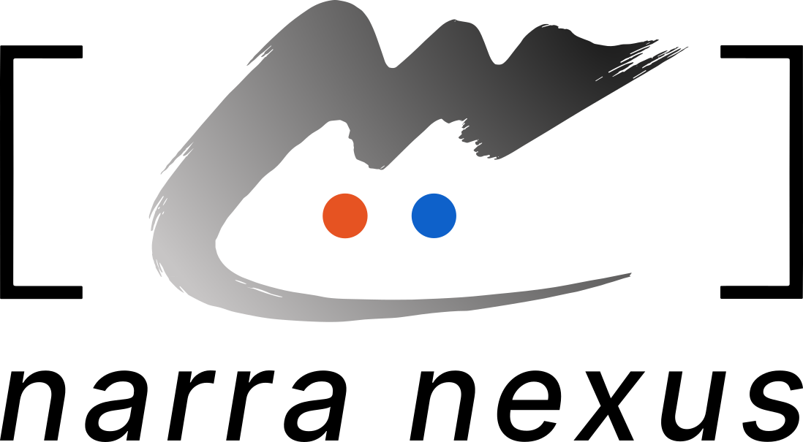

<!--
Draft: Structure A+ (Dev-focused, governance-aware) — 中文
Date: 2026-05-28
README_A 的变体 —— 采纳同事在 README_advice.md 中关于 contribution
section 的建议（#1、#3、#4、#6）。clone-URL 建议（#2）按用户要求未采纳。

相对 README_A.zh.md 的改动：
  - 语言切换下方加一行小字 "遇到 bug 或需要帮助？" 链接到 Issues / Discussions（#6）
  - hero 与 "60 秒上手" 之间加 "用 AI 编码助手开发？" callout（#1）
  - "## 如何贡献" 重写为 "## 贡献与治理" —— 纯导航，链接 AGENTS.md /
    CLAUDE.md / GOVERNANCE.md / MAINTAINERS.md / CODE_OF_CONDUCT.md /
    SECURITY.md / .mindflow/_overview.md，结尾给 git-shortlog 提示
    （#3 + #4）。"我做了 template / Module / 改代码" 的细节移到
    CONTRIBUTING.md 处理。
-->

<div align="center">

<picture>
  <source media="(prefers-color-scheme: dark)" srcset="../docs/images/NarraNexusLogo_v2/narra-nexus-logo-text-dark-mode.svg">
  
</picture>

<br/>
<br/>

# 别从零搭一个 Agent。一键和一支专业团队协作。

[](https://creativecommons.org/licenses/by-nc/4.0/)
[](https://narra.nexus/docs/getting-started/quick-start)
[](#社群)

[English](./README_Aplus.en.md) | **中文**

<br/>
<sub>遇到 bug 或需要帮助？· <a href="https://github.com/NetMindAI-Open/NarraNexus/issues/new/choose">提 issue</a> · <a href="https://github.com/NetMindAI-Open/NarraNexus/discussions">讨论区</a></sub>

</div>

---

<br/>

<p align="center">
  <em>懂记忆、懂协作、会用工具的 agent —— template 起步，也可以自己搭。</em>
</p>

<p align="center">
  
</p>

<p align="center">
  <em>90 秒看完：安装、核心理念、几个 template 速览。</em>
</p>

<p align="center">
  <a href="#templates">看更多 templates →</a>
</p>

<p align="center">
  <em>用 AI 编码助手开发？</em><br/>
  把 <a href="./CLAUDE.md"><code>CLAUDE.md</code></a>（铁律）和
  <a href="./.mindflow/_overview.md"><code>.mindflow/_overview.md</code></a>（mirror 文档索引）
  喂给 Claude Code、Cursor、Continue —<br/>
  你的 agent 立刻按本项目规范工作。
  完整指南：<a href="./CONTRIBUTING.md"><code>CONTRIBUTING.md</code></a>。
</p>

<br/>

---

##  60 秒上手

NarraNexus 是一个多 Agent 产品 —— 不是给开发者搭 agent 的 framework，是直接给你一支可以协作的 agent 团队。三种部署方式，选你顺手的一种。

### ☁️ 云端注册 —— 最快，带免费体验额度

1. 打开 [agent.narra.nexus](https://agent.narra.nexus/login)
2. 注册账号
3. 选一个 template，开始

<!-- TODO: 云端注册 demo video, ~30s -->

> [!NOTE]
> **想在本地跑（桌面端或源码）？** 两件事要知道：
> - **需要你自己的 LLM API key。** 桌面端和本地 build 都用你自己的 key —— 可以用 Claude Code 登录，或申请一个 NetMind.AI Power key（一个 key，一分钟搞定）。在 **Settings** 里配置 —— 见 [Configure LLM Providers](https://narra.nexus/docs/getting-started/quick-start)。
> - **本地端口要空着。** 两种方式都会起若干本地 service，确认对应端口没被占用。

### 💻 macOS 桌面应用

桌面端自带 runtime —— 不用装 Python / Node / Docker。

1. [下载 app](https://github.com/NetMindAI-Open/NarraNexus/releases/latest)
2. 拖入 Applications 文件夹
3. 启动 → 选一个 template，开始

<!-- TODO: dmg 安装 demo video, ~30s -->

### 🛠️ 从源码（开发者）

```bash
git clone https://github.com/NetMindAI-Open/NarraNexus.git
cd NarraNexus
bash run.sh
```

`run.sh` 自动检测前置依赖（`uv` / `node` / `tmux`）并启动所有本地 service。完整的 service / 端口列表和详细安装见 [开发文档](https://narra.nexus/docs/getting-started/quick-start)。

<p align="center">
  <video src="../docs/videos/install-local.mp4" controls width="720">
    你的浏览器不支持 video tag。<a href="../docs/videos/install-local.mp4">下载 demo (MP4)</a>。
  </video>
</p>

> 三种入口，殊途同归。

---

##  三大能力

按"agent 实际能做什么"组织。

### 类人的 Agent 员工

- **身份** —— 每个 agent 有持久的身份和偏好（**Awareness module**），跨会话记得"它是谁、在为谁工作"。
- **记忆** —— 对话被自动归到不同 storyline；**Narrative memory** 用 embedding 检索话题，不是按时间无脑排。
- **人脉** —— **Social Network module** 让 agent 记住打交道的人和实体，并对每个对象形成定制化的互动风格。
- **工具** —— 每个 agent 都能调用 MCP 工具，装一个新 skill 一句话就能搞定，不用改代码。

### Agent 间真协作

- **MessageBus 协议** —— agent 之间直接对话：@mention、建房间、群聊，不只是跟你聊。
- **防失控** —— 内置 rate limit 和 poison message 检测，防止 agent loop 跑飞。
- **按能力发现** —— 一个 agent 要找懂 SQL 的 helper，搜一下就有。

### Batteries included

- **10 个内置模块** —— Memory · Awareness · Chat · SocialNetwork · Jobs · Skills · MessageBus · Lark · CommonTools · BasicInfo。每个模块自带 DB schema、MCP tools 和生命周期 hook。
- **多 LLM** —— Anthropic / OpenAI / Gemini 通过统一适配层接入。
- **4 种 Trigger 模式** —— Chat / Job / MessageBus / Matrix·Lark，共用同一个 6 步流水线。

---

<a name="templates"></a>

##  Reference Templates

参考实现 —— 直接套用，或 fork 一份自己改。

### 金融市场晨报 (Financial Morning Briefing)

适合每天 7 点要看市场的投资者、研究员。**6 个 agent** 每天 08:00 (Asia/Shanghai) 把一份分析师级别的 HTML 简报送到你邮箱。不是又一份新闻摘要 —— 回答的是 *"今天市场在交易什么？我该进攻、防守还是观望？"*

**[narra.nexus/templates/financial-morning-briefing →](https://www.narra.nexus/templates/financial-morning-briefing)**

<!-- TODO: Financial Morning Briefing template demo video, ~30s -->

### KOL Assistant

适合接 sponsorship 的内容创作者。**4 个 agent** 解析进来的 sponsor 邮件、维护 CRM、跨平台监测品牌提及 —— 让你把时间花在下一条视频上，而不是收件箱。

**[narra.nexus/templates/kol-assistant →](https://www.narra.nexus/templates/kol-assistant)**

<!-- TODO: KOL Assistant template demo video, ~30s -->

### PM Bridge Bot

适合同时要管内部协作和外部客户沟通的团队。一个 bot 维护两套可搜索的知识库 —— 内部专用 + 对客共享 —— 把每段聊天、每份文档、每条会议记录自动归档到正确的范围。说话语气按对象调整，语种自动识别。

**[narra.nexus/templates/pm-bridge-bot →](https://www.narra.nexus/templates/pm-bridge-bot)**

<!-- TODO: PM Bridge Bot template demo video, ~30s -->

### 更多社区贡献的 template → [浏览全部](https://narra.nexus/docs/modules/custom-modules)

> *全部由 NarraNexus agent 自主完成。*

---

##  诚实边界

- **LLM API key**：线上版有免费额度可以试用。日常或本地用，需要你自己的 LLM API key —— 一两分钟在 NetMind / OpenAI / Anthropic 注册一个就够。
- **Agent 不是一上来就 100 分**：它需要你纠错、给反馈，越用越合手。把它当一个新员工，不是当神。
- **协作不是一次完美**：复杂任务往往要 agent 跑两三轮才上手；总有一些判断只能你来做 —— 团队跑通大部分，关键的判断留给你自己。
- **架构权衡**：每个 agent 启动自己的 MCP 进程，启动时大约多 100ms。chat-style workflow 不在意；高频 job 可以切到 Direct Trigger mode。

---

##  社群

<a name="社群"></a>

- **Discord** —— `即将上线`
- **Twitter / X** —— `即将上线`
- **邮件订阅** —— `即将上线`
- **反馈** —— [GitHub Issues](https://github.com/NetMindAI-Open/NarraNexus/issues)

---

##  贡献与治理

NarraNexus 同时为人类贡献者和 AI Agent 贡献者设计。

**从这里开始：**

- 新贡献者 → [`CONTRIBUTING.md`](./CONTRIBUTING.md)
- AI 编码助手 → [`AGENTS.md`](./AGENTS.md)（厂商中立）或直接读 [`CLAUDE.md`](./CLAUDE.md)
- 给 AI 看的项目地图 → [`.mindflow/_overview.md`](./.mindflow/_overview.md)

**项目治理：**

- 治理与维护者团队 → [`GOVERNANCE.md`](./GOVERNANCE.md)、[`MAINTAINERS.md`](./MAINTAINERS.md)
- 社区准则 → [`CODE_OF_CONDUCT.md`](./CODE_OF_CONDUCT.md)
- 安全策略 → [`SECURITY.md`](./SECURITY.md)

当前维护者团队见 [`MAINTAINERS.md`](./MAINTAINERS.md)。运行 `git shortlog -sn` 可看完整贡献者列表。

---

## 许可证

[CC BY-NC 4.0](./LICENSE)

<!--
Alternative hooks (kept for record):

Current (A3):
  - "别只部署一个 agent。直接组一支团队。"  ← CURRENT (A3-zh)
  - "Don't deploy an agent. Launch a team."   ← A3-en counterpart

Other candidates considered:
  - A1: "一支 agent 团队，一键启动。"
  - A2: "一键启动你的 agent 团队。"
  - A4: "一键。一支 agent 团队。上线。"
  - A5: "不止 personal assistant —— 一键启动一支 agent 团队。"
  - A6: "一个多 Agent 产品，一键启动。"

合并版金句（备用，给老板挑）：
  "大多数 agent 工具是为开发者做的。NarraNexus 是为其他所有人做的。"
-->
